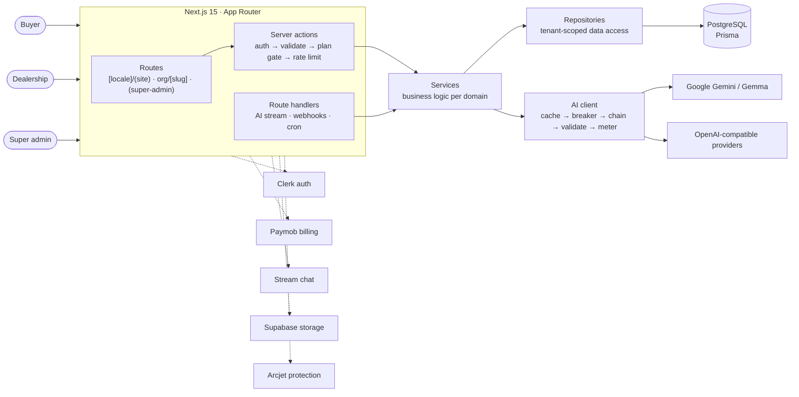
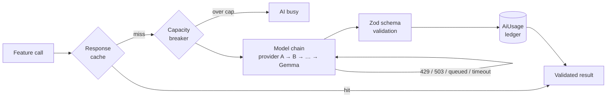
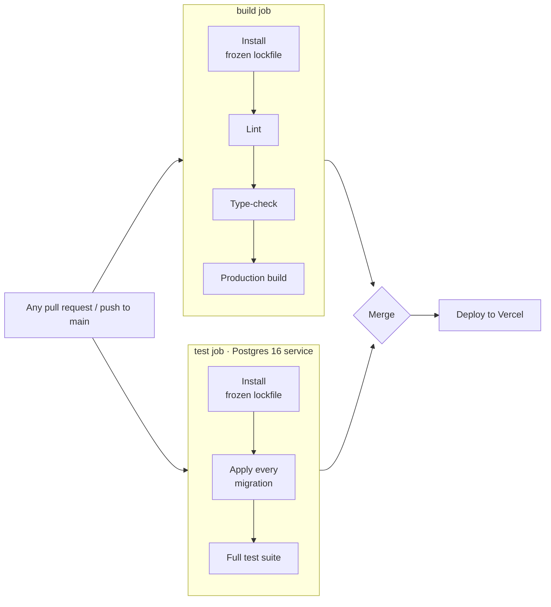

<div align="center">

# AutoMe

### AI-powered SaaS for car dealerships in Egypt

Dealerships subscribe, showcase their new and used cars on a branded storefront, run the business from one back office, and let AI do the slow parts of selling: writing listings from photos, translating them, and answering buyers around the clock — in Arabic and English.

[](https://github.com/mahmoud-abo-al-ela/AutoMe/actions/workflows/ci.yml)
[](https://nextjs.org)
[](https://www.typescriptlang.org)
[](https://www.prisma.io)
[](https://ai.google.dev)
[](https://paymob.com)
[](https://vitest.dev)

[AI capabilities](#ai-capabilities) • [SaaS model](#saas-model) • [Architecture](#architecture) • [Design decisions](#key-design-decisions) • [Getting started](#getting-started) • [CI/CD](#cicd) • [Deployment](#deployment)

</div>

## Overview

AutoMe is a multi-tenant marketplace and dealership platform built for the Egyptian car market. Dealerships list whatever they sell — new cars and used — on their own storefront and in the shared marketplace.

- **Buyers** search, compare and save cars, chat with dealers, book test drives, and ask an AI assistant anything about a listing.
- **Dealerships** run inventory, team, test drives, billing and buyer conversations from one dashboard, and publish a storefront on their own subdomain.
- **The platform team** manages dealerships, plans and support from a super-admin console with audit logs and impersonation.

AI is not a feature bolted onto the side — it is how a car gets listed, how a listing reaches both halves of a bilingual market, and how a buyer's question gets answered at 2 a.m. It runs through one metered, provider-agnostic client, and every output that reaches a buyer is checked against data before it is shown.

> [!NOTE]
> One market, done properly: prices in Egyptian pounds (EGP), Arabic as a first-class language (right-to-left layout, Arabic-Indic digits, Egyptian phrasing, Arabic-aware search), and English alongside it.

## AI capabilities

| Capability | What it does | How it stays trustworthy |
| --- | --- | --- |
| **Listing from photos** | Reads up to three photos of a car and drafts the whole listing — make, model, generation years, specs, features, title and description in both languages — streaming progress as it writes | Reads badges and lettering *before* naming the car; enum fields are constrained by the response schema; the dealer confirms the year when a photo can only show the generation |
| **Buyer listing assistant** | Answers buyers' questions on the car page with directions, call and test-drive buttons, and cards for the dealership's other cars it recommends | Answers only from a record of facts about the car, cites the facts it used, and is rejected if a citation does not hold; otherwise it says the dealer can answer — never guesses |
| **Dealer knowledge loop** | Questions the assistant could not answer, and answers buyers rated 👎, land in the dealer's Buyer Questions inbox | The dealer's reply becomes a fact the assistant cites from then on — the assistant gets better from the dealer, not from guessing |
| **Market price context** | Places a car's price among comparable listings on the platform (same model, widening to the same make and body type) | The numbers are computed in code, not by the model; it states the comparison and never calls a price a good or bad deal |
| **Bilingual listings** | Writes the other language on save, in natural Egyptian-market Arabic or English | Only the language the dealer changed is re-translated; a failure saves the car untranslated rather than blocking it |
| **Listing-quality coach** | Scores a draft listing with deterministic rules and adds tailored AI advice per issue | The score is rule-based and reproducible; the model only explains |
| **Photo descriptions** | Describes each photo for accessibility, SEO and the assistant's knowledge of what the car looks like | Platform-paid and low priority, so it never competes with a dealer waiting on the AI |
| **Photo search** | Buyers search the marketplace with a photo of a car they like | Runs on a fast, separate model chain; metered but never billed to a dealership |

## SaaS model

- **Tenancy.** Each dealership is an organization with its own members, roles, subdomain and data. Every repository query is scoped by an organization id resolved on the server from the session and subdomain — never from request input.
- **Subscriptions.** Starter, Pro and Enterprise plans priced in EGP and paid through Paymob, a payment each period: renewal reminders a week and three days ahead, a seven-day grace, then the free plan. An upgrade is paid now; a downgrade waits for the paid period to end. Paymob's callbacks are HMAC-verified and idempotent, and a daily job looks up any payment whose callback never arrived.
- **Entitlements.** Plans gate features and set limits on cars, team members, photos per car and **AI listings per month**. Limits are enforced on the server in the same guard stack as authentication.
- **Usage metering.** Every AI call writes a ledger row — tenant, feature, provider, model, tokens, latency, outcome — on success *and* failure. That ledger drives plan limits, per-provider capacity caps and cost reporting. A plan's AI allowance counts cars saved with AI's help, so the photo read, translation and advice behind one listing are one use.
- **Fair use.** Free-plan traffic runs at a lower priority against shared AI capacity, so paying dealerships are never the ones told "AI busy".

## Architecture



**Request path.** Route → server action → service → repository → Prisma. Each server action runs the same guards in the same order: authentication and tenant resolution (`withOrgAuth`), Zod validation, plan gate and usage limit, then rate limiting. Route handlers under `app/api/` assemble the same guards themselves.

**AI path.** Every model call goes through `generateStructured` in `lib/ai/client.ts` — the only code that talks to a provider, so no call can skip metering:



<details>
<summary><strong>Project structure</strong></summary>

```
app/                 Routes: [locale]/(site) public site, [locale]/org/[slug] dealer
                     dashboard, [locale]/(super-admin), api/ (AI stream, uploads,
                     webhooks, cron)
actions/             Server actions — the guard stack lives here
lib/services/        Business logic, one folder per domain
lib/repositories/    Data access; every query takes a server-sourced tenant id
lib/ai/              AI client, providers, model chains, prompts, schemas, grounding,
                     evaluations
lib/middleware/      Auth, plan gates, usage limits, rate limits, validation
messages/{en,ar}/    Translations, one file per area
prisma/              Schema, migrations and seed
```

</details>

## Key design decisions

**One door to the models.** A single client owns caching, capacity, failover, validation and metering. Features describe *what* they need — a task, a prompt, a schema — and never *which* model or provider. Adding a provider is a registry entry and an API key.

**Failover over retries.** A saturated model answering 503 will not recover in a retry, so busy, rate-limited, queued and timed-out calls move to the next model in the chain — across providers — instead of waiting in the same queue. A request that has not started streaming within its first-token budget counts as queued.

**Schemas as contracts.** Each AI feature's Zod schema is sent to the model as its response schema *and* validates what comes back. Field order is deliberate: the model decides whether a question is about the car, and names the facts it will rely on, before it writes the answer.

**Grounded by construction.** The assistant sees a curated record of facts — listing fields, dealer disclosures, working hours, other inventory, computed market prices, the dealer's own answers — and must cite them. Citations are checked in code. Buttons and car cards it suggests are rebuilt from the database, never from model output.

**Untrusted input stays data.** Buyer questions, dealer-written descriptions and text inside photos are passed as data, never as instructions. Live evaluations plant instructions in each of them and check they are ignored.

**Fail closed.** Missing rate-limit keys refuse requests in production; cron routes refuse to run without their secret and compare it in constant time; webhooks reject unsigned payloads and replays.

**Arabic is not a translation.** Arabic copy is written as Arabic for an Egyptian reader, not translated sentence by sentence; layouts use logical CSS properties so they mirror correctly; search folds Arabic spelling variants so "سياره" finds "سيارة".

## Tech stack

| Area | Technology |
| --- | --- |
| Application | Next.js 15 (App Router, Server Actions, streaming), React 19, TypeScript |
| Data | PostgreSQL, Prisma 7, full-text search with Arabic normalization; Supabase storage |
| AI | Google Gemini and Gemma, OpenAI-compatible providers; Zod-derived JSON schemas |
| Identity and billing | Clerk, Paymob |
| Realtime | Stream Chat |
| Security | Arcjet rate limiting, bot detection and shield; Zod validation at every boundary |
| Localization | next-intl, Arabic (RTL) and English |
| UI | Tailwind CSS 4, shadcn/ui, TanStack Query |
| Observability | Sentry; AI usage ledger; development trace of each assistant question |
| Quality | Vitest unit and integration suite; live AI evaluations |

## Getting started

### Prerequisites

- Node.js 22+ and pnpm 9 (`corepack enable` installs the pinned version)
- PostgreSQL (a Supabase project provides the database and file storage)
- Clerk, Paymob (an Egyptian merchant account), Stream and Arcjet accounts, and at least one AI provider key

### Run locally

```bash
git clone https://github.com/mahmoud-abo-al-ela/AutoMe.git
cd AutoMe
pnpm install                 # also generates the Prisma client
# create .env — see the variables below
pnpm prisma migrate deploy   # create the schema
pnpm db:seed                 # plans, sample dealerships and cars
pnpm dev                     # http://localhost:3000
```

Dealership storefronts are served on subdomains; locally, open `http://<slug>.localhost:3000`.

> [!IMPORTANT]
> After a change to `prisma/schema.prisma`, run `pnpm db:generate` **and restart the dev server** — the Prisma client is cached across hot reloads.

<details>
<summary><strong>Environment variables</strong></summary>

**Required**

| Variable | Purpose |
| --- | --- |
| `DATABASE_URL` | PostgreSQL connection string |
| `NEXT_PUBLIC_CLERK_PUBLISHABLE_KEY`, `CLERK_SECRET_KEY`, `CLERK_WEBHOOK_SECRET` | Authentication and the Clerk webhook |
| `NEXT_PUBLIC_SUPABASE_URL`, `NEXT_PUBLIC_SUPABASE_PUBLISHABLE_DEFAULT_KEY`, `SUPABASE_SERVICE_ROLE_KEY` | Image storage |
| `PAYMOB_SECRET_KEY` | Secret: creates checkouts (Intention API) and refunds |
| `PAYMOB_PUBLIC_KEY` | Public: opens Paymob's hosted checkout page |
| `PAYMOB_API_KEY` | Secret: looks payments up when a callback is late or lost |
| `PAYMOB_HMAC_SECRET` | Secret: verifies Paymob's transaction callback |
| `PAYMOB_CARD_INTEGRATION_ID` | The card integration offered at checkout; its test/live mode must match the keys |
| `CRON_SECRET` | Authorizes `/api/cron/*`. Billing depends on it: the daily renewals job sends reminders, ends grace periods and catches missed payments |
| `NEXT_PUBLIC_STREAM_API_KEY`, `STREAM_API_SECRET` | Buyer–dealer chat |
| `ARCJET_KEY` | Rate limiting — production refuses requests without it |
| `GEMINI_API_KEY` and/or `CODECRAFT_API_KEY` | AI providers |
| `NEXT_PUBLIC_APP_URL`, `NEXT_PUBLIC_ROOT_DOMAIN` | Public URL and the domain dealership subdomains hang off |

**Optional**

| Variable | Purpose |
| --- | --- |
| `PAYMOB_WALLET_INTEGRATION_ID` | Mobile-wallet integration, for when wallets are offered at checkout (not yet) |
| `NEXT_PUBLIC_SENTRY_DSN`, `SENTRY_AUTH_TOKEN` | Error monitoring and source maps |
| `EMAILJS_SERVICE_ID`, `EMAILJS_TEMPLATE_ID`, `EMAILJS_PUBLIC_KEY`, `EMAILJS_PRIVATE_KEY`, `FROM_EMAIL`, `CONTACT_EMAIL` | Contact form and notification email |
| `CODECRAFT_API_KEY_2`, `CODECRAFT_API_KEY_3`, … | Extra keys for a provider, used in order |
| `AI_MODELS_VISION`, `AI_MODELS_TEXT`, `AI_MODELS_VISION_FAST`, `AI_MODELS_TEXT_FAST` | Override a task's model chain, e.g. `google/gemini-3.6-flash,codecraft/gpt-5.5` |
| `AI_BILLING_MODE` | `free` (default) records AI cost as zero; change it on a paid key |

</details>

> [!WARNING]
> Never commit `.env`. Rotate any key that has been shared outside your secret store.

<details>
<summary><strong>Scripts</strong></summary>

| Command | Description |
| --- | --- |
| `pnpm dev` | Development server (Turbopack) |
| `pnpm build` / `pnpm start` | Production build and server |
| `pnpm lint` / `pnpm typecheck` | ESLint and TypeScript |
| `pnpm test` / `pnpm test:watch` | Vitest suite |
| `pnpm db:migrate` | Create and apply a migration in development |
| `pnpm db:seed` / `pnpm db:reset` | Seed / reset and re-seed the database |
| `pnpm db:studio` | Prisma Studio |

</details>

## Quality

```bash
pnpm typecheck && pnpm test                    # 800+ unit and integration tests
AI_EVAL=1 pnpm vitest run lib/ai/evaluation    # live evaluations against real models
```

The unit suite covers the guard stack, tenancy, billing, metering and every AI feature with the providers mocked. The live evaluations check what mocks cannot: that the assistant declines what a listing does not say, that instructions planted in a photo, a description or a question are ignored, that a licence plate in a photo never reaches the public listing, and that Arabic output is Arabic. They spend provider quota, so they only run with `AI_EVAL=1`, and a provider at capacity skips a case rather than failing it.

## CI/CD

Every pull request — whatever branch it targets — and every push to `main` runs the [CI workflow](.github/workflows/ci.yml) on GitHub Actions; it can also be started by hand. A newer push cancels the run it supersedes.



- **Reproducible installs.** `--frozen-lockfile` fails the run if `package.json` changed without the lockfile.
- **The migrations are tested, not just the code.** The test job applies every migration to a fresh PostgreSQL 16 — including the full-text search column, the `pg_trgm` extension and the GIN indexes — then runs the database-backed suites against it: the webhook idempotency race, a payment settled by two callers at once creating exactly one dealership, the billing-email ledger, and Arabic/English search ranking.
- **A real production build.** `next build` prerenders pages and runs module-level code, which catches failures a type-check cannot.
- **No real secrets.** Both jobs run on placeholder credentials that cannot reach a real service; the only secret is a Clerk *development* key the build needs to validate its format.

Delivery is to Vercel. Database migrations are applied to production as a deliberate step before the code that needs them ships — never implicitly during a build.

## Deployment

Built for [Vercel](https://vercel.com).

> [!IMPORTANT]
> Apply migrations to the production database (`pnpm prisma migrate deploy`) **before** deploying code that depends on them.

- Enable **Fluid compute** — the AI routes declare `maxDuration = 300` to outlast provider queues.
- Set Paymob's transaction callback to `https://<your-domain>/api/webhooks/paymob` (each checkout also names it). It must be public HTTPS, which Paymob cannot reach on localhost: test payments against a preview deployment. (Locally, the payment success pages still confirm a payment by asking Paymob directly.) Point Clerk's webhook at `/api/webhooks/clerk`.
- Set `CRON_SECRET`: `vercel.json` runs `/api/cron/billing-renewals` daily at 05:00 UTC (07:00–08:00 Cairo). Plan prices are edited in EGP in the super-admin plan editor.
- Add a wildcard domain (`*.your-domain`) so dealership storefronts resolve.
- Run `POST /api/cron/backfill-image-alts` (with `CRON_SECRET`) until it reports nothing remaining, to describe photos of cars listed before photo descriptions existed.
